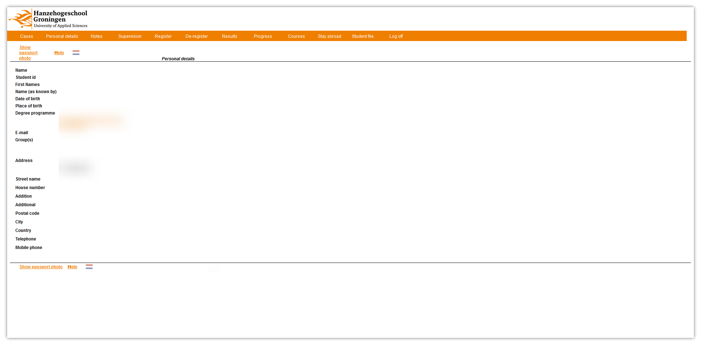
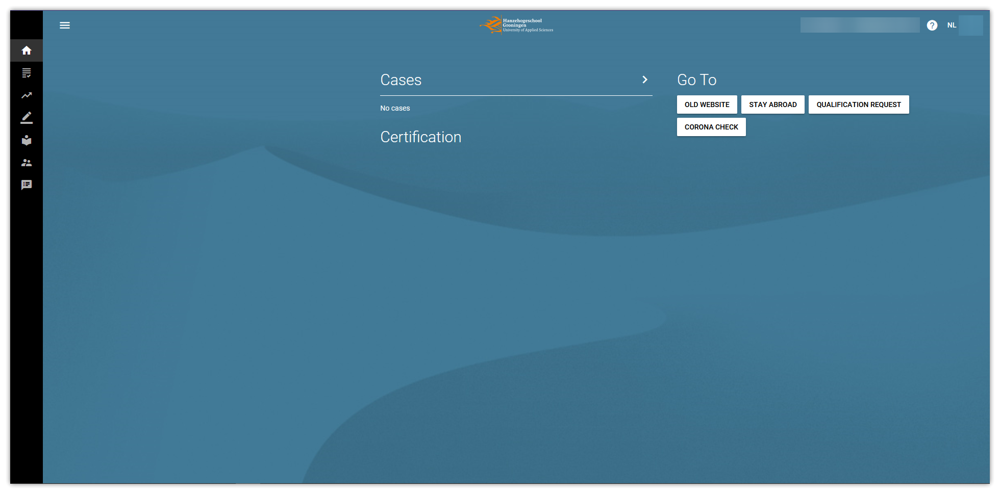

<!--

Makrdown Syntax: https://www.markdownguide.org/basic-syntax

Edit things below this point.
Make sure to keep heading for each section and do not make big blocks of text.

-->

# Osiris Versions

At some point Osiris made an update to the web version and now it has the same display as the mobile application. You can still access the old version. We have outlined the information on how to find them on both versions.

## Old Osiris

<button style="width: 100%;display: grid;">[View Information](./old/o-personal-details.md){.md-button .md-button-primary}</button>

## New Osiris

<button style="width: 100%;display: grid;">[View Information](./new/n-personal-details.md){.md-button .md-button-primary}</button>
